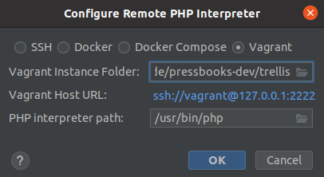
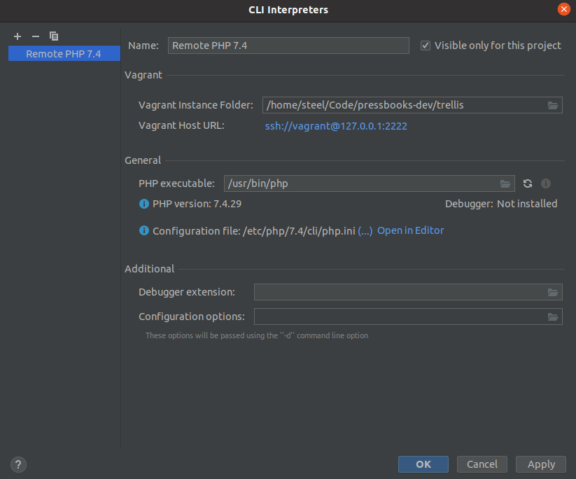
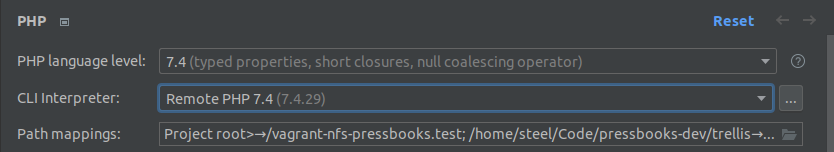

## Enable WordPress Integration

Go to Settings → PHP → Frameworks → WordPress, click enable and set installation path to `~/Code/pressbooks-dev/site/web/wp`:

![WordPress integration][1]

## NPM

Right click on package.json, select "Show npm Scripts":

![npm Tasks][2]

## Databases

[comment]: # "TODO: rewrite this section"

In the Database tool window (View → Tool Windows → Database), click the plus symbol, select Data Source → MySQL:

![Databases][3]

In the SSH/SSL tab:

- Proxy host: pressbooks.test (Port: 22)
- Proxy user: vagrant
- Auth type: Key pair (OpenSSH)
- Private key file: `~/Code/pressbooks-dev/trellis/.vagrant/machines/default/virtualbox/private_key`

In the General tab (Tip: Credentials are comming from the `/site/.env` file):

- Host: 127.0.0.1 (Port: 3306)
- Database: pressbooks_test_development
- User: pressbooks_test
- Password: example_dbpassword

In the General tab for the testing database _(use the same config as above for SSH/SSL)_:

- Host: 127.0.0.1 (Port: 3306)
- Database: pressbooks_tests
- User: pressbooks_test
- Password:

## Configure Remote PHP Interpreter

Open Settings → PHP and find the CLI Interpreter option. Click the three dots [...], click the plus symbol, select "From Docker, Vagrant, VM, WSL, Remote" and set "Vagrant Instance File" to your Trellis directory.

## XDebug

Update to the latest PHPStorm and get the [Xdebug Helper][5] Chrome plugin.

Go to Settings → PHP &gt; Servers, create a new server named pressbooks.test and map:

- `pressbooks-dev/site` to `/srv/www/pressbooks.test/current`
- `pressbooks-dev/trellis` to `/home/vagrant/trellis`

![Xdebug Setup][6]

Enable Xdebug Helper in Chrome, set some break points in PhpStorm,enable the "Start Listening for PHP Debug Connections" telephone icon in PhpStorm, reload the website in Chrome:

![Xdebug In Action][7]

## Configure Remote PHPUnit

Settings → PHP → Test Frameworks, create a new configuration based on Remote Interpreter, set path to autoload and configuration to point to files on remote server:

![PHPUnit][8]

Click the three dots [...] next to path mappings and set `pressbooks-dev/site` to `/srv/www/pressbooks.test/current`:

![PHP Mappings][9]

Create and run new test configurations with "Test scope: Defined in the configuration file"

![PHPUnit Running][10]

Troubleshooting: If you have restarted your VM you will see a `PHP Fatal error: require_once(): Failed opening required '/tmp/wordpress-tests-lib/includes/functions.php'` Fix by re-runing `bin/install-wp-tests.sh` (@see [Unit Testing][11] and [Coding Standards][12])

[1]: ../images/phpstorm-wp.png
[2]: ../images/npm-tasks.png
[3]: ../images/Databases.png
[5]: https://chrome.google.com/webstore/detail/xdebug-helper/eadndfjplgieldjbigjakmdgkmoaaaoc?utm_source=chrome-app-launcher-info-dialog
[6]: ../images/Xdebug-1.png
[7]: ../images/Xdebug-2.png
[8]: ../images/PHPUnit.png
[9]: ../images/PHP-Mappings.png
[10]: ../images/PHPUnit-Running.png
[11]: /unit-testing/
[12]: /coding-standards/
